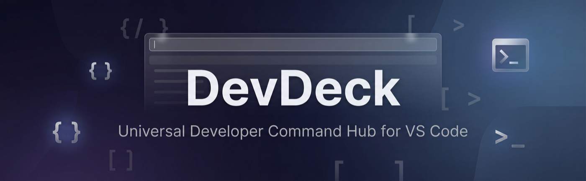
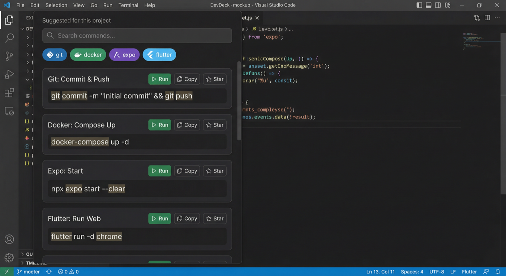

# DevDeck

  

  
  
  
  
  
  
  

Universal Developer Command Hub for VS Code.  
Search commands in natural language, understand flags instantly, fill parameters safely, and run directly in terminal without leaving your editor.

## Why DevDeck
- **No context switching:** command discovery happens inside VS Code.
- **Cross-stack coverage:** 21 tool ecosystems, including `expo`, `flutter`, `react-native`, `react`, `docker`, `kubernetes`, and more.
- **Fast command retrieval:** fuzzy and intent-friendly search across thousands of commands.
- **Run-ready workflows:** parameterized commands, copy/run actions, favorites, and history.
- **Team onboarding:** project commands loaded from `.devdeck.json`.

## UI Preview

  

## Features
- Sticky command search with debounced ranking and match highlighting.
- Category chips + project-aware suggested commands.
- Pinned quick sections: Suggested, Favorites, Recent commands.
- Command cards with parameter fields, tags, and safe run checks.
- Keyboard-first interactions (`Ctrl/Cmd+K`, arrows, enter, escape).
- Comfortable/Compact density modes for different browsing styles.
- Host → UI toast feedback for copy, run, and favorite actions.

## Getting Started
1. Install dependencies:
   - `yarn`
2. Generate command packs:
   - `yarn generate:data`
3. Validate and build:
   - `yarn check`
   - `yarn lint`
   - `yarn build`
4. Open in VS Code and launch Extension Development Host.

## Command Dataset
- Built-in command packs are generated under `data/`.
- Current generated catalog includes **2100+ commands** across 21 tools.
- Regenerate any time with:
  - `yarn generate:data`

## Contributor Badge Program
We celebrate contributors publicly.

- Every merged contribution is recognized via contributor badges.
- The repository includes an automated badge workflow for merged PRs.
- Contributor count badge updates automatically from GitHub.

Badge tiers:
- **First Contribution**
- **Bronze Contributor** (3+ merged PRs)
- **Silver Contributor** (7+ merged PRs)
- **Gold Contributor** (15+ merged PRs)

## Project Commands (`.devdeck.json`)
DevDeck loads custom workspace commands from `.devdeck.json` and reloads them automatically when the file changes.

## Contributing
See `CONTRIBUTING.md` for standards, data schema expectations, and PR guidelines.
